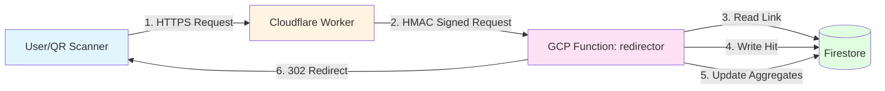
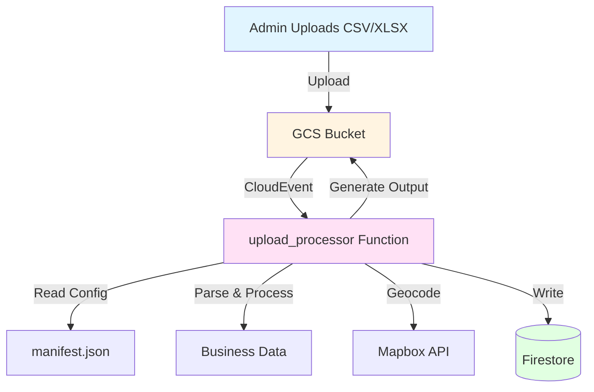
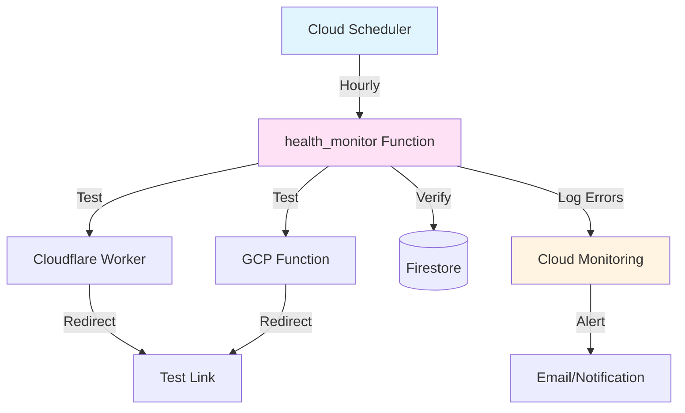
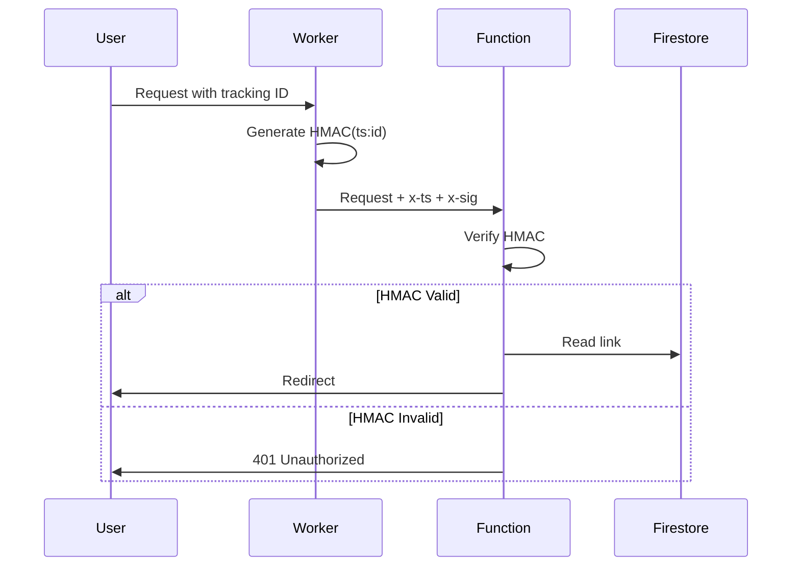

# Architecture Documentation

## System Architecture Overview

GB QR Tracker is a distributed system that combines edge computing (Cloudflare Workers) with serverless backend processing (Google Cloud Functions) and a NoSQL database (Firestore).

## Component Architecture

### Request Flow Architecture



### Data Processing Architecture



### Monitoring Architecture



## Detailed Component Design

### Cloudflare Worker

**Purpose**: Edge routing and request forwarding

**Location**: `workers/redirector/src/index.ts`

**Responsibilities**:
1. Extract tracking ID from URL (path or query)
2. Generate HMAC signature for backend verification
3. Forward request to GCP Function
4. Return redirect response to user

**Key Design Decisions**:
- **Edge Routing**: Reduces latency by routing at Cloudflare's edge
- **HMAC Verification**: Prevents unauthorized direct access to GCP Function
- **Health Endpoint**: Served instantly from edge (no backend call)

**Configuration**:
- Routes configured per environment (dev/prod)
- Environment variables for backend URL and HMAC secret
- TypeScript for type safety

### Redirector Function

**Purpose**: Core redirect and analytics logic

**Location**: `functions/redirector/main.py`

**Responsibilities**:
1. Verify HMAC signature from Worker
2. Validate and extract link ID
3. Read link document from Firestore
4. Update aggregates (links, businesses, campaigns)
5. Create hit document with analytics
6. Perform redirect

**Key Design Decisions**:
- **Non-blocking Analytics**: Hit writes never block redirect
- **Batch Updates**: Aggregate updates in single batch
- **Privacy-First**: No raw IP storage, optional hashing
- **Geolocation**: Supports MaxMind DB (local) or API (external)

**Performance Optimizations**:
- Firestore batch writes for aggregates
- Optional TTL on hit documents
- Minimal field reads (select only needed fields)

### Upload Processor Function

**Purpose**: Bulk business data processing

**Location**: `functions/upload_processor/main.py`

**Responsibilities**:
1. Trigger on GCS file upload
2. Parse CSV/XLSX files
3. Deduplicate businesses by address
4. Generate unique link IDs
5. Geocode addresses (optional)
6. Create Firestore documents (batch writes)
7. Generate output file with tracking links

**Key Design Decisions**:
- **Idempotent Processing**: Can re-run safely
- **Collision Handling**: Automatic ID suffix generation
- **Blacklist Support**: Filter businesses before processing
- **Template Mapping**: Support for template assignment
- **Error Resilience**: Continue processing on individual row errors

**Processing Flow**:
```
1. Download file from GCS
2. Load manifest.json (config)
3. Parse CSV/XLSX → rows
4. Filter blacklisted businesses
5. Precompute base IDs for all rows
6. Query existing IDs (batch)
7. Assign final IDs (handle collisions)
8. Process rows (geocode, create documents)
9. Batch commit to Firestore
10. Generate output file
11. Upload to GCS
12. Generate report
```

**ID Generation Algorithm**:
```python
def assign_final_ids(precomputed):
    # Group by base_id
    groups = group_by_base_id(precomputed)
    
    for base_id, items in groups:
        # Query existing variants once
        taken = query_existing_variants(base_id)
        
        for item in items:
            # Assign base_id or base_id-N
            item['final_id'] = next_available_id(base_id, taken)
```

### Health Monitor Function

**Purpose**: System health monitoring

**Location**: `functions/health_monitor/main.py`

**Responsibilities**:
1. Check health endpoints (Worker and Function)
2. Perform test scans via both paths
3. Verify database writes
4. Clean up test hits
5. Log errors for Cloud Monitoring

**Key Design Decisions**:
- **Dual Path Testing**: Tests both Worker and direct Function paths
- **Database Verification**: Confirms data is actually written
- **Automatic Cleanup**: Deletes test hits after verification
- **Error Logging**: Structured logs for Cloud Monitoring alerts

**Test Flow**:
```
1. Check health endpoints (all environments)
2. Perform test scan via Worker (with HMAC)
3. Perform test scan via direct Function
4. Query Firestore for test hit
5. Verify hit data matches expected
6. Delete test hit
7. Log results
```

## Data Model Design

### Canonical vs Customer-Specific Data

**Design Pattern**: Split business data into canonical (shared) and customer-specific overlays.

**Canonical Business** (`businesses/{businessId}`):
- Shared across all customers
- Contains: name, address, coordinates
- Multiple customers can reference same business

**Customer Overlay** (`customers/{uid}/businesses/{businessId}`):
- Customer-specific data
- Contains: phone, email, contact name, hit counts
- Each customer has their own view

**Benefits**:
- Data deduplication (same business, multiple customers)
- Privacy isolation (customer-specific contact info)
- Efficient storage (shared canonical data)

### Link ID Generation

**Requirements**:
- Human-readable
- URL-safe
- Collision-free
- Deterministic (for re-processing)

**Algorithm**:
1. Extract base ID from business data:
   - Domain from email (if business email)
   - Business name (normalized)
   - Custom ID from CSV
2. Sanitize: Remove special chars, normalize
3. Check for collisions: Query existing variants
4. Assign: Use base or base-N suffix

**Collision Handling**:
- Query existing IDs with prefix match
- Find max suffix number
- Assign next available number

### Hit Document Design

**Fields**:
- **References**: link_id, campaign_ref, business_ref, target_ref
- **Analytics**: device_type, ua_browser, ua_os, referer
- **Geolocation**: geo_country, geo_region, geo_city, geo_lat, geo_lon
- **Privacy**: ip_hash (salted SHA256, no raw IP)
- **Metadata**: ts, hit_origin, is_test_data

**TTL Support**:
- Optional `expires_at` field
- Configured via `HIT_TTL_DAYS` env var
- Firestore TTL policy deletes expired documents

### Campaign Aggregates

**Design**: Denormalized totals for fast queries

**Structure**:
```python
campaign = {
    "totals": {
        "targets": 1000,      # Total businesses
        "links": 950,          # Links created
        "hits": 5000,          # Total clicks
        "unique_ips": 1200     # Unique visitors
    }
}
```

**Update Strategy**:
- Increment on each hit (Firestore.Increment)
- Batch updates for performance
- Server-side timestamps

## Security Architecture

### Authentication Flow



### HMAC Signature

**Purpose**: Verify requests come from Cloudflare Worker

**Algorithm**:
```
message = "{timestamp}:{link_id}"
signature = HMAC-SHA256(secret, message)
```

**Verification**:
- Check timestamp within 5-minute window (replay protection)
- Compare signatures (timing-safe)
- Reject if invalid

### Access Control

**Customer Isolation**:
- All queries filtered by `owner_id`
- Firestore security rules enforce ownership
- Customer-specific subcollections

**Admin Functions**:
- `create_customer`: Requires `isAdmin` claim
- `delete_campaign`: Requires ownership or admin
- `health_monitor`: Requires authentication

## Scalability Considerations

### Firestore Limits

**Document Size**: 1 MB max
- Hit documents: ~500 bytes (well within limit)
- Link documents: ~1 KB (within limit)

**Write Rate**: 1 write/second per document
- Aggregates use Firestore.Increment (atomic)
- Hit writes are non-blocking (async)

**Query Limits**:
- Composite indexes for complex queries
- Pagination for large result sets
- Batch reads for multiple documents

### Function Scaling

**Redirector**:
- Stateless (scales horizontally)
- Cold start: ~1-2 seconds
- Memory: 256 MiB (sufficient)

**Upload Processor**:
- Memory: 1 GiB (for large files)
- Timeout: 540s (9 minutes)
- Batch processing for efficiency

### Storage Optimization

**Hit Documents**:
- TTL for automatic cleanup
- Indexes only on queried fields
- Optional aggregation queries

**Business Documents**:
- Canonical data shared (reduces duplicates)
- Customer overlays small (~200 bytes)

## Error Handling

### Redirector Errors

**Non-blocking**:
- Hit write failures (logged, don't block redirect)
- Aggregate update failures (logged, don't block redirect)
- Geolocation failures (optional, don't block)

**Blocking**:
- Invalid link ID (400)
- Link not found (404)
- Inactive link (410)
- Invalid destination (500)

### Upload Processor Errors

**Row-level Errors**:
- Individual row failures logged
- Processing continues for other rows
- Error details in report

**Fatal Errors**:
- Invalid manifest.json
- Missing required fields
- Duplicate campaign code
- Storage errors

### Health Monitor Errors

**Error Logging**:
- Structured logs with `[HEALTH_MONITOR_FAIL]` prefix
- Component and check type included
- Cloud Monitoring alerts on errors

## Performance Metrics

### Redirector Performance

- **P50 Latency**: ~100ms (edge to redirect)
- **P95 Latency**: ~200ms
- **P99 Latency**: ~500ms

### Upload Processor Performance

- **Small File (100 rows)**: ~10 seconds
- **Medium File (1000 rows)**: ~60 seconds
- **Large File (10000 rows)**: ~8 minutes

### Firestore Costs

- **Reads**: ~$0.06 per 100k
- **Writes**: ~$0.18 per 100k
- **Storage**: ~$0.18 per GB/month

## Monitoring & Observability

### Cloud Monitoring

**Metrics**:
- Function invocations
- Function errors
- Function latency
- Firestore operations

**Alerts**:
- Health monitor failures
- Function errors
- High latency

### Logging

**Structured Logs**:
- JSON format for parsing
- Component identification
- Error context

**Log Levels**:
- INFO: Normal operations
- WARNING: Recoverable issues
- ERROR: Failures requiring attention

## Future Enhancements

### Potential Improvements

1. **Caching**: Redis for frequently accessed links
2. **Analytics Aggregation**: Pre-computed dashboards
3. **Real-time Updates**: WebSocket for live analytics
4. **A/B Testing**: Multiple destinations per link
5. **Custom Domains**: Per-customer domain support

### Scalability Improvements

1. **Sharding**: Partition links by customer
2. **Read Replicas**: Reduce Firestore read latency
3. **CDN**: Cache static assets
4. **Queue Processing**: Async hit processing

