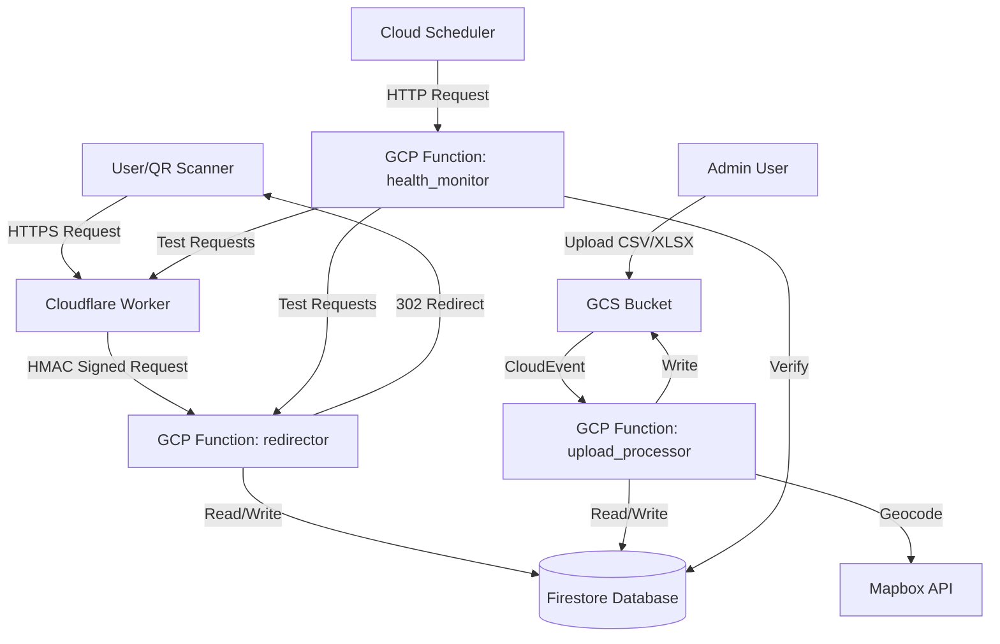
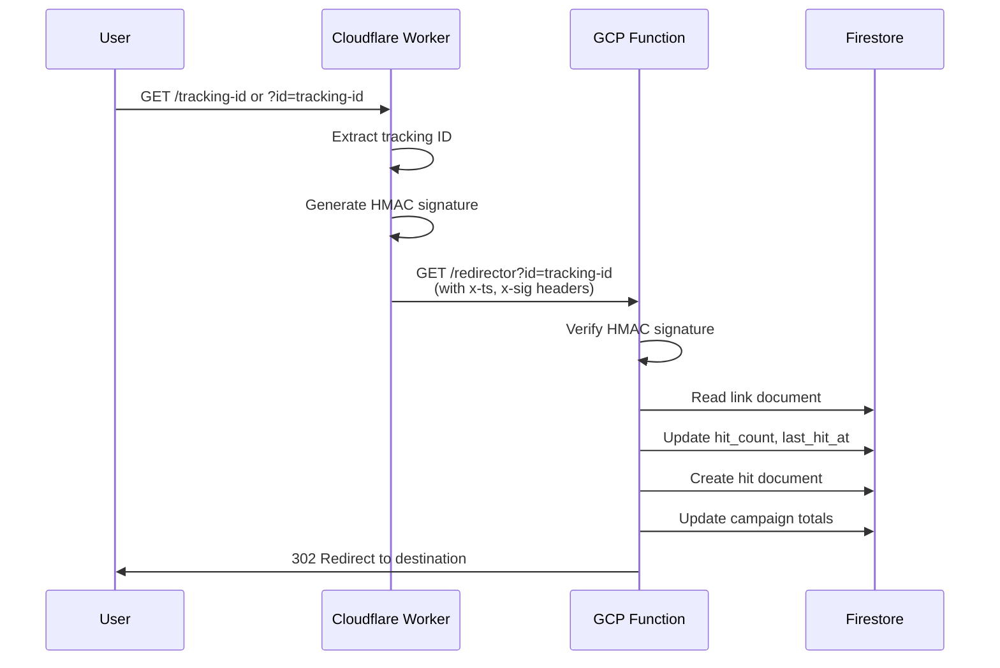

# GB QR Tracker - Comprehensive Documentation

A production-ready QR code and trackable link system built on Google Cloud Platform and Cloudflare Workers. Enables businesses to create trackable links/QR codes for marketing campaigns with detailed analytics on clicks, device types, geolocation, and user behavior.

## Table of Contents

1. [Introduction & Overview](#introduction--overview)
2. [System Architecture](#system-architecture)
3. [Core Components](#core-components)
4. [Data Models & Firestore Schema](#data-models--firestore-schema)
5. [API Documentation](#api-documentation)
6. [Deployment Guide](#deployment-guide)
7. [Usage Guide](#usage-guide)
8. [Configuration](#configuration)
9. [Development Guide](#development-guide)
10. [Troubleshooting](#troubleshooting)

## Introduction & Overview

### Purpose

GB QR Tracker is a scalable link tracking and analytics platform designed for marketing campaigns. It provides:

- **Trackable Links**: Generate unique tracking IDs for each business/recipient
- **QR Code Support**: Links can be embedded in QR codes for print materials
- **Detailed Analytics**: Track clicks, device types, browsers, OS, geolocation, and referrers
- **Campaign Management**: Organize links by campaigns with templates
- **Business Data Processing**: Bulk import businesses from CSV/XLSX files
- **Privacy-Focused**: Optional IP hashing, TTL-based data retention

### Key Features

- **Edge Routing**: Cloudflare Worker for fast global redirects
- **Analytics Collection**: Per-hit logging with user-agent parsing and geolocation
- **Bulk Processing**: Automated CSV/XLSX upload processing with business deduplication
- **Campaign Organization**: Links organized by campaigns with template support
- **Health Monitoring**: Automated health checks for all endpoints
- **Multi-tenant**: Customer isolation with owner-based access control

### Technology Stack

- **Backend**: Google Cloud Functions (Gen 2) - Python 3.11
- **Edge**: Cloudflare Workers - TypeScript
- **Database**: Google Cloud Firestore
- **Storage**: Google Cloud Storage (Firebase Storage)
- **Authentication**: Firebase Authentication
- **Secrets**: Google Cloud Secret Manager
- **Monitoring**: Google Cloud Monitoring

## System Architecture

### High-Level Overview



### Request Flow



### Component Architecture

#### Cloudflare Worker
- **Purpose**: Edge routing and request forwarding
- **Location**: `workers/redirector/`
- **Features**:
  - Extracts tracking ID from path or query parameter
  - Generates HMAC signature for backend verification
  - Forwards requests to GCP Function
  - Serves health endpoint instantly from edge

#### Google Cloud Functions

1. **redirector** (`functions/redirector/`)
   - HTTP-triggered function
   - Handles link redirects and analytics collection
   - Updates aggregates (links, businesses, campaigns)
   - Writes hit documents

2. **upload_processor** (`functions/upload_processor/`)
   - Storage-triggered function (GCS bucket events)
   - Processes CSV/XLSX business files
   - Creates links, businesses, targets, and campaigns
   - Geocodes addresses (optional)
   - Generates tracking links

3. **health_monitor** (`functions/health_monitor/`)
   - HTTP-triggered function
   - Checks health endpoints
   - Performs test scans
   - Verifies database writes
   - Logs errors for Cloud Monitoring

4. **create_customer** (`functions/create_customer/`)
   - HTTP-triggered function
   - Creates Firebase Auth users
   - Creates customer documents
   - Sets custom claims

5. **list_campaign_files** (`functions/list_campaign_files/`)
   - HTTP-triggered function
   - Lists files in campaign storage folders
   - Generates signed download URLs

6. **delete_campaign** (`functions/delete_campaign/`)
   - HTTP-triggered function
   - Cascade deletes campaign data
   - Cleans up storage files

## Core Components

### Cloudflare Worker

**Location**: `workers/redirector/src/index.ts`

**Key Functions**:
- `fetch()`: Main request handler
- `hmacHex()`: HMAC signature generation

**Configuration** (wrangler.jsonc):
- Routes: `dev.rocket-letter.de/*` (dev), `go.rocket-letter.de/*` (prod)
- Environment variables: `BACKEND_FUNCTION_URL`, `WORKER_HMAC_SECRET`

**ID Extraction**:
- Query parameter: `?id=TRACKING-ID`
- Path: `/TRACKING-ID` or `/r/TRACKING-ID` or `/go/TRACKING-ID`

### Redirector Function

**Location**: `functions/redirector/main.py`

**Entry Point**: `redirector(request: Request)`

**Key Features**:
- Link ID validation (regex: `^[A-Za-z0-9_äöüÄÖÜß-]{1,64}$`)
- HMAC signature verification
- User-agent parsing (device type, browser, OS)
- Geolocation (MaxMind DB or API)
- IP hashing (optional, salted SHA256)
- Hit document creation
- Aggregate updates (links, businesses, campaigns)
- Unique IP tracking per campaign

**Environment Variables**:
- `HIT_TTL_DAYS`: Optional TTL for hit documents
- `GEOIP_DB_PATH`: Path to MaxMind GeoLite2 database
- `GEOIP_API_URL`: External geolocation API URL template
- `STORE_IP_HASH`: Enable IP hashing (0/1)
- `IP_HASH_SALT`: Salt for IP hashing
- `LOG_HIT_ERRORS`: Log hit write errors (0/1)
- `WORKER_HMAC_SECRET`: HMAC secret for Worker verification

### Upload Processor Function

**Location**: `functions/upload_processor/main.py`

**Entry Point**: `process_business_upload(cloud_event)`

**Trigger**: Google Cloud Storage object finalized event

**Key Features**:
- CSV/XLSX parsing with auto-delimiter detection
- Business deduplication by address
- Link ID generation with collision handling
- Campaign creation/updates
- Target creation (one per business row)
- Geocoding via Mapbox (optional)
- Blacklist filtering
- Template mapping
- Output file generation with tracking links

**Processing Flow**:
1. Download uploaded file from GCS
2. Load manifest.json (if present) for configuration
3. Parse CSV/XLSX into rows
4. Filter blacklisted businesses
5. Generate business IDs and link IDs
6. Geocode addresses (if enabled)
7. Create/update Firestore documents (batch writes)
8. Generate output file with tracking links
9. Upload output file to GCS
10. Generate and upload processing report

**Key Functions**:
- `assign_links_from_business_file()`: Main processing logic
- `make_business_id()`: Generate normalized business ID
- `sanitize_id()`: Sanitize IDs for Firestore
- `assign_final_ids()`: Handle ID collisions
- `geocode_mapbox()`: Geocode addresses
- `load_blacklist()`: Load customer blacklist

### Health Monitor Function

**Location**: `functions/health_monitor/main.py`

**Entry Point**: `health_monitor(request: Request)`

**Features**:
- Health endpoint checks (Worker and Function, dev & prod)
- Test scan via Worker path (with HMAC)
- Test scan via direct Function path
- Database verification (checks hit was written)
- Automatic hit cleanup after verification
- Error logging for Cloud Monitoring alerts

**Configuration**:
- `TEST_LINK_ID`: Link ID to use for testing
- `CLOUDFLARE_WORKER_DEV_URL`: Worker dev URL
- `CLOUDFLARE_WORKER_PROD_URL`: Worker prod URL
- `GCP_FUNCTION_DEV_URL`: Function dev URL
- `GCP_FUNCTION_PROD_URL`: Function prod URL
- `ADDITIONAL_DOMAINS`: Comma-separated additional domains to test

### Create Customer Function

**Location**: `functions/create_customer/main.py`

**Entry Points**:
- `create_customer_http(request)`: HTTP Cloud Function
- `main_cli()`: CLI mode

**Features**:
- Creates Firebase Auth user
- Creates customer document in Firestore
- Sets custom claims (isAdmin, userId)
- Idempotent operations

### List Campaign Files Function

**Location**: `functions/list_campaign_files/main.py`

**Entry Point**: `list_campaign_files_http(request: Request)`

**Features**:
- Lists files in `uploads/{env}/{uid}/{campaignId}/source`
- Lists files in `uploads/{env}/{uid}/{campaignId}/templates`
- Generates signed download URLs (1 hour expiry)
- Returns file metadata (name, size, type, download URL)

### Delete Campaign Function

**Location**: `functions/delete_campaign/main.py`

**Entry Point**: `delete_campaign(request: Request)`

**Features**:
- Cascade deletion of campaign data
- Deletes: hits, targets, links, unique_ips, campaign doc
- Optional: Delete unused businesses
- Optional: Delete storage files
- Dry-run mode for preview
- Batch deletion for large datasets

## Data Models & Firestore Schema

### Collections Overview

- `links`: Tracking link documents
- `hits`: Individual click/scan events
- `businesses`: Canonical business data (shared across customers)
- `customers/{uid}/businesses`: Customer-specific business overlays
- `campaigns`: Campaign documents
- `campaigns/{campaignId}/targets`: Target documents (one per business in campaign)
- `campaigns/{campaignId}/unique_ips`: Unique IP tracking per campaign
- `customers`: Customer/user documents
- `customers/{uid}/blacklist`: Blacklisted business IDs

### Links Collection

**Path**: `links/{linkId}`

**Schema**:
```typescript
{
  // Core fields
  destination: string;              // URL to redirect to
  active: boolean;                   // Whether link is active
  short_code: string;                 // Human-readable ID (same as document ID)
  
  // References
  campaign_ref: DocumentReference;    // Reference to campaign
  business_ref: DocumentReference;    // Reference to business
  target_ref: DocumentReference;      // Reference to target
  owner_id: string;                   // Customer UID
  
  // Analytics aggregates
  hit_count: number;                  // Total clicks
  last_hit_at: Timestamp;             // Last click timestamp
  
  // Metadata
  template_id?: string;               // Template identifier
  campaign_name?: string;             // Denormalized campaign name
  snapshot_mailing?: {                 // Snapshot of mailing data
    business_name?: string;
    address_lines?: string[];
    postcode?: string;
    city?: string;
    country?: string;
  };
  
  // Timestamps
  created_at: Timestamp;
}
```

**Indexes**:
- `owner_id` (ASC) + `last_hit_at` (DESC)
- `campaign_ref` (ASC) + `last_hit_at` (DESC)
- `business_ref` (ASC) + `hit_count` (DESC)
- `campaign_ref` (ASC) + `hit_count` (DESC)
- `owner_id` (ASC) + `hit_count` (DESC)

### Hits Collection

**Path**: `hits/{hitId}`

**Schema**:
```typescript
{
  // Link reference
  link_id: string;                    // Link document ID
  
  // References
  campaign_ref?: DocumentReference;
  business_ref?: DocumentReference;
  target_ref?: DocumentReference;
  owner_id?: string;
  
  // Analytics data
  ts: Timestamp;                       // Server timestamp
  user_agent: string;                  // Raw user agent string
  device_type: string;                  // 'mobile' | 'tablet' | 'desktop' | 'bot' | 'other'
  ua_browser: string;                  // Parsed browser (e.g., "Chrome 120.0")
  ua_os: string;                       // Parsed OS (e.g., "iOS 17.0")
  referer?: string;                    // HTTP referer header
  
  // Geolocation (optional)
  geo_country?: string;                // ISO country code
  geo_region?: string;                 // Region/state code
  geo_city?: string;                   // City name
  geo_lat?: number;                    // Latitude
  geo_lon?: number;                   // Longitude
  geo_source?: string;                 // 'maxmind' | 'api'
  
  // Privacy
  ip_hash?: string;                    // SHA256(salt + IP) if enabled
  
  // Origin tracking
  hit_origin: string;                  // 'cloudflare_worker' | 'direct'
  campaign_name?: string;              // Denormalized campaign name
  template_id?: string;                 // Template identifier
  
  // Test data marker
  is_test_data?: boolean;              // True if from health monitor
}
```

**Indexes**:
- `link_id` (ASC) + `ts` (DESC)
- `link_ref` (ASC) + `ts` (DESC)
- `owner_id` (ASC) + `ts` (DESC)
- `owner_id` (ASC) + `ts` (ASC)
- `campaign_ref` (ASC) + `hit_count` (DESC)
- `business_ref` (ASC) + `ts` (DESC)
- `hit_origin` (ASC) + `ts` (DESC)

**TTL**: Optional `expires_at` field for automatic deletion (configured in Firestore console)

### Businesses Collection

**Path**: `businesses/{businessId}`

**Schema** (Canonical - shared across customers):
```typescript
{
  business_id: string;                 // Normalized ID (same as document ID)
  business_name: string;               // Company name
  street?: string;                     // Street name
  house_number?: string;               // House number
  postcode?: string;                   // Postal code
  city?: string;                       // City name
  address?: string;                    // Full formatted address
  coordinate?: {                       // Geocoded coordinates
    lat: number;
    lon: number;
    source: string;                    // 'mapbox'
  };
  ownerIds: string[];                  // Array of customer UIDs who own this business
  created_at: Timestamp;
}
```

**Customer-Specific Overlay**:
**Path**: `customers/{uid}/businesses/{businessId}`

**Schema**:
```typescript
{
  business_ref: DocumentReference;    // Reference to canonical business
  phone?: string;                      // Phone number
  email?: string;                      // Email address
  name?: string;                       // Contact person name
  salutation?: string;                 // Salutation
  hit_count: number;                   // Hits for this customer
  last_hit_at?: Timestamp;             // Last hit timestamp
  updated_at: Timestamp;
}
```

**Indexes**:
- `search_terms` (ARRAY_CONTAINS) + `hit_count` (DESC)
- `ownerIds` (ARRAY_CONTAINS) + `hit_count` (DESC)

### Campaigns Collection

**Path**: `campaigns/{campaignId}`

**Schema**:
```typescript
{
  campaign_id: string;                 // Same as document ID
  campaign_name: string;               // Display name
  code?: string;                       // Unique campaign code (normalized, uppercase)
  owner_id: string;                    // Customer UID
  status: string;                      // 'draft' | 'active' | 'archived'
  
  totals: {
    targets: number;                    // Total targets (businesses)
    links: number;                      // Total links created
    hits: number;                      // Total clicks
    unique_ips: number;                 // Unique IP addresses
  };
  
  created_at: Timestamp;
  updated_at: Timestamp;
  last_hit_at?: Timestamp;
}
```

**Indexes**:
- `owner_id` (ASC) + `updated_at` (DESC)
- `code` (ASC) - for uniqueness checks

### Targets Collection

**Path**: `campaigns/{campaignId}/targets/{targetId}`

**Schema**:
```typescript
{
  business_ref: DocumentReference;     // Reference to business
  link_ref?: DocumentReference;        // Reference to link (if created)
  status: string;                      // 'linked' | 'validated' | 'excluded'
  reason_excluded?: string;            // Why excluded (e.g., "No destination")
  import_row: object;                  // Original CSV/XLSX row data
  dedupe_key: string;                  // Normalized key for deduplication
  created_at: Timestamp;
  updated_at: Timestamp;
}
```

### Customers Collection

**Path**: `customers/{uid}`

**Schema**:
```typescript
{
  owner_id: string;                    // Same as document ID (Firebase UID)
  email?: string;                      // Email address
  display_name?: string;               // Display name
  plan: string;                        // 'free' | 'pro' | 'enterprise'
  is_active: boolean;                   // Account status
  settings: {
    timezone: string;                   // e.g., "Europe/Berlin"
    locale: string;                     // e.g., "de-DE"
  };
  created_at: Timestamp;
}
```

### Blacklist Collection

**Path**: `customers/{uid}/blacklist/{blacklistId}`

**Schema**:
```typescript
{
  business_id: string;                 // Business ID to blacklist
  business?: DocumentReference;         // Reference to business (optional)
  created_at?: Timestamp;
}
```

## API Documentation

### Redirector Endpoint

**URL**: `https://{region}-{project}.cloudfunctions.net/redirector`

**Method**: `GET`

**Parameters**:
- `id` (query): Tracking ID (required)

**Headers** (from Cloudflare Worker):
- `x-ts`: Unix timestamp
- `x-sig`: HMAC-SHA256 signature of `{ts}:{id}`

**Response**:
- `302 Found`: Redirect to destination URL
- `400 Bad Request`: Invalid or missing ID
- `404 Not Found`: Link not found
- `410 Gone`: Link is inactive
- `500 Internal Server Error`: Invalid destination

**Example**:
```bash
curl "https://europe-west3-gb-qr-tracker.cloudfunctions.net/redirector?id=example-link-123"
# → 302 Redirect to destination URL
```

### Upload Processor Webhook

**Trigger**: Google Cloud Storage object finalized event

**Bucket**: `gb-qr-tracker.firebasestorage.app` (prod) or `gb-qr-tracker-dev.firebasestorage.app` (dev)

**Path Pattern**: `uploads/{env}/{uid}/{campaignId}/source/{filename}.{csv|xlsx}`

**Manifest File** (optional): `uploads/{env}/{uid}/{campaignId}/manifest.json`

**Manifest Schema**:
```json
{
  "ownerId": "firebase-uid",
  "base_url": "https://go.rocket-letter.de",
  "destination": "https://example.com/landing",
  "campaign_code": "SPRING25",
  "campaign_name": "Spring Campaign 2025",
  "campaignId": "uuid-string",
  "limit": 1000,
  "skip_existing": true,
  "geocode": true,
  "mapbox_token": "optional-override",
  "tracking_url_prefix": "https://ihr-brief.de"
}
```

**Output Files**:
- `uploads/{env}/{uid}/{campaignId}/source/{filename}_with_links.{csv|xlsx}`
- `uploads/{env}/{uid}/{campaignId}/upload_report.json`

**Report Schema**:
```json
{
  "upload_id": "campaignId-timestamp",
  "timestamp": "2025-01-15T10:30:00Z",
  "campaign": {
    "campaign_id": "uuid",
    "campaign_name": "Spring Campaign",
    "campaign_code": "SPRING25"
  },
  "statistics": {
    "total_rows": 1000,
    "processed_rows": 950,
    "successful_links": 900,
    "targets_created": 950,
    "blacklisted": { "count": 10, "businesses": [...] },
    "errors": { "count": 5, "details": [...] },
    "excluded": { "count": 40, "reason": "no_destination" },
    "geocoding": { "enabled": true, "successful": 850, "failed": 50 }
  },
  "status": "completed"
}
```

### Health Monitor API

**URL**: `https://{region}-{project}.cloudfunctions.net/health_monitor`

**Method**: `GET`

**Authentication**: Firebase ID token (Bearer token)

**Response**:
```json
{
  "timestamp": "2025-01-15T10:30:00Z",
  "overall_success": true,
  "health_checks": {
    "worker_dev": { "success": true, "error": null },
    "worker_prod": { "success": true, "error": null },
    "gcp_dev": { "success": true, "error": null },
    "gcp_prod": { "success": true, "error": null }
  },
  "test_scans": {
    "worker_dev": {
      "success": true,
      "error": null,
      "db_verified": true,
      "response": {
        "status_code": 302,
        "location": "https://example.com",
        "path": "worker",
        "environment": "dev"
      }
    },
    "direct_dev": { ... },
    "worker_prod": { ... },
    "direct_prod": { ... }
  },
  "summary": {
    "all_health_ok": true,
    "all_tests_ok": true,
    "all_db_verified": true
  }
}
```

### Create Customer API

**URL**: `https://{region}-{project}.cloudfunctions.net/create_customer`

**Method**: `POST`

**Authentication**: Firebase ID token with `isAdmin: true` claim

**Request Body**:
```json
{
  "email": "owner@acme.com",
  "display_name": "Acme GmbH",
  "plan": "pro",
  "is_active": true,
  "set_admin": false
}
```

**Response**:
```json
{
  "ok": true,
  "uid": "firebase-uid",
  "user_created": true,
  "customer_created": true,
  "claims": {
    "isAdmin": false,
    "userId": "firebase-uid"
  }
}
```

### List Campaign Files API

**URL**: `https://{region}-{project}.cloudfunctions.net/list_campaign_files`

**Method**: `POST`

**Authentication**: Firebase ID token

**Request Body**:
```json
{
  "campaignId": "uuid-string",
  "env": "dev",
  "uid": "firebase-uid"
}
```

**Response**:
```json
{
  "files": [
    {
      "name": "businesses_with_links.xlsx",
      "path": "uploads/dev/uid/campaignId/source/businesses_with_links.xlsx",
      "size": 12345,
      "downloadUrl": "https://storage.googleapis.com/...",
      "type": "xlsx",
      "folder": "source",
      "updated": "2025-01-15T10:30:00Z"
    }
  ],
  "source": [...],
  "templates": [...]
}
```

### Delete Campaign API

**URL**: `https://{region}-{project}.cloudfunctions.net/delete_campaign`

**Method**: `POST`

**Authentication**: Firebase ID token (must own campaign)

**Request Body**:
```json
{
  "campaignId": "uuid-string",
  "storage": {
    "bucket": "gb-qr-tracker.firebasestorage.app",
    "prefix": "uploads/prod/uid/campaignId/"
  },
  "deleteBusinesses": false,
  "dryRun": false,
  "confirm": true
}
```

**Response**:
```json
{
  "ok": true,
  "deleted": {
    "hits": 1500,
    "targets": 1000,
    "unique_ips": 500,
    "links": 1000,
    "businesses": 0,
    "campaignDoc": 1,
    "storageBlobs": 5
  }
}
```

## Deployment Guide

See [DEPLOYMENT.md](DEPLOYMENT.md) for detailed deployment instructions.

### Quick Start

1. **Set up environment variables**:
   ```bash
   # Create .env.dev and .env.prod files
   export PROJECT_ID="gb-qr-tracker-dev"
   export REGION="europe-west3"
   export SA="your-service-account@project.iam.gserviceaccount.com"
   ```

2. **Deploy a function**:
   ```bash
   ./deploy.sh dev redirector
   ```

3. **Deploy Cloudflare Worker**:
   ```bash
   cd workers/redirector
   npm run deploy
   ```

## Usage Guide

### Creating a Campaign

1. **Prepare business file** (CSV or XLSX):
   - Required columns: Business name, address fields
   - Optional columns: Email, phone, template, domain

2. **Create manifest.json**:
   ```json
   {
     "ownerId": "firebase-uid",
     "base_url": "https://go.rocket-letter.de",
     "destination": "https://example.com/landing",
     "campaign_code": "SPRING25",
     "campaign_name": "Spring Campaign 2025",
     "campaignId": "uuid-string",
     "limit": 1000,
     "geocode": true
   }
   ```

3. **Upload to GCS**:
   ```bash
   gsutil cp businesses.xlsx gs://gb-qr-tracker.firebasestorage.app/uploads/prod/uid/campaignId/source/
   gsutil cp manifest.json gs://gb-qr-tracker.firebasestorage.app/uploads/prod/uid/campaignId/
   ```

4. **Wait for processing** (check upload_report.json)

### Generating Tracking Links

Tracking links are automatically generated during upload processing. The output file contains:
- `tracking_link`: Full URL with query parameter
- `tracking_url`: Short URL for printing (e.g., `ihr-brief.de/tracking-id`)
- `tracking_id`: The tracking ID

### Viewing Analytics

Query Firestore collections:
- `hits`: Individual click events
- `links`: Link aggregates (hit_count, last_hit_at)
- `campaigns`: Campaign totals

Example query:
```python
from google.cloud import firestore

db = firestore.Client()
campaign_ref = db.collection('campaigns').document('campaign-id')
campaign = campaign_ref.get().to_dict()
print(f"Total hits: {campaign['totals']['hits']}")
```

### Blacklist Management

Add businesses to blacklist:
```python
blacklist_ref = db.collection('customers').document(uid).collection('blacklist')
blacklist_ref.add({
    'business_id': 'business-id-to-block',
    'created_at': firestore.SERVER_TIMESTAMP
})
```

## Configuration

See [DEPLOYMENT.md](DEPLOYMENT.md) for detailed configuration.

### Environment Variables

**Redirector**:
- `HIT_TTL_DAYS`: TTL for hit documents (optional)
- `GEOIP_API_URL`: Geolocation API URL template
- `STORE_IP_HASH`: Enable IP hashing (0/1)
- `IP_HASH_SALT`: Salt for IP hashing (secret)
- `LOG_HIT_ERRORS`: Log hit write errors (0/1)
- `WORKER_HMAC_SECRET`: HMAC secret (secret)

**Upload Processor**:
- `PROJECT_ID`: GCP project ID
- `DATABASE_ID`: Firestore database ID
- `MAPBOX_TOKEN`: Mapbox API token (secret)

**Health Monitor**:
- `TEST_LINK_ID`: Test link ID
- `CLOUDFLARE_WORKER_DEV_URL`: Worker dev URL
- `CLOUDFLARE_WORKER_PROD_URL`: Worker prod URL
- `GCP_FUNCTION_DEV_URL`: Function dev URL
- `GCP_FUNCTION_PROD_URL`: Function prod URL
- `ADDITIONAL_DOMAINS`: Additional domains to test
- `WORKER_HMAC_SECRET`: HMAC secret (secret)

### Firestore Indexes

Import indexes:
```bash
gcloud firestore indexes import firestore_indexes/composite-indexes.json
```

See `firestore_indexes/` directory for index definitions.

### Secrets Management

Create secrets in Secret Manager:
```bash
echo -n "your-secret-value" | gcloud secrets create SECRET_NAME --data-file=-
```

Reference in config files:
```bash
SECRETS=(
  "SECRET_NAME=projects/$PROJECT_ID/secrets/SECRET_NAME:latest"
)
```

## Development Guide

See [DEVELOPMENT.md](DEVELOPMENT.md) for detailed development instructions.

### Local Setup

1. **Install dependencies**:
   ```bash
   pip install -r functions/redirector/requirements.txt
   pip install -r functions/upload_processor/requirements.txt
   ```

2. **Set up service account**:
   ```bash
   export GOOGLE_APPLICATION_CREDENTIALS="path/to/service-account.json"
   ```

3. **Run functions locally**:
   ```bash
   functions-framework --target=redirector --source=functions/redirector
   ```

### Testing

Run health monitor manually:
```bash
curl -H "Authorization: Bearer $(gcloud auth print-identity-token)" \
  https://europe-west3-gb-qr-tracker-dev.cloudfunctions.net/health_monitor
```

## Troubleshooting

### Common Issues

**Link not found (404)**:
- Verify link exists in Firestore
- Check link ID matches exactly (case-sensitive)
- Verify link is active

**HMAC verification fails**:
- Ensure `WORKER_HMAC_SECRET` matches in Worker and Function
- Check timestamp is within 5-minute window
- Verify secret doesn't have quotes in env var

**Upload processing fails**:
- Check manifest.json syntax
- Verify ownerId exists
- Check Firestore permissions
- Review function logs in Cloud Console

**Geocoding fails**:
- Verify Mapbox token is valid
- Check address format
- Review geocoding stats in upload report

### Debugging

**View function logs**:
```bash
gcloud functions logs read redirector --limit=50
```

**Check Firestore data**:
```bash
gcloud firestore documents get links/tracking-id
```

**Test redirect manually**:
```bash
curl -v "https://go.rocket-letter.de/tracking-id"
```

## Additional Resources

- [Architecture Details](ARCHITECTURE.md)
- [API Reference](API.md)
- [Deployment Guide](DEPLOYMENT.md)
- [Development Guide](DEVELOPMENT.md)
